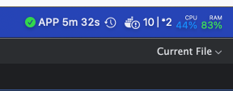

# Vercel Status Menu Bar

A lightweight macOS menu bar app that monitors your Vercel deployment status in real-time.



## What It Does

This app sits in your macOS menu bar and continuously monitors your Vercel deployments. It provides:

- Real-time deployment status updates
- Visual indicators for deployment states (building, ready, error, etc.)
- Quick access to deployment information
- Configurable API token through preferences

## Installation

### Pre-built Binary (Easiest)

1. Download the latest release from the [Releases](../../releases) page
2. Unzip and move the app to your Applications folder
3. Launch the app
4. Click the menu bar icon and select "Preferences" to configure your Vercel API token

### Build from Source

Requirements:
- macOS 13.0 or later
- Xcode 15.0 or later
- Swift 5.9 or later

```bash
# Clone the repository
git clone https://github.com/YOUR_USERNAME/vercel-status-menubar.git
cd vercel-status-menubar

# Build the app
swift build -c release

# Run the app
.build/release/vercel-status-menubar
```

## Configuration

1. Get your Vercel API token from [Vercel Account Settings](https://vercel.com/account/tokens)
2. Click the menu bar icon
3. Select "Preferences"
4. Enter your API token
5. The app will start monitoring your deployments automatically

## How It Works

The app uses the Vercel API to:
1. Fetch your deployment list periodically
2. Check the status of each deployment
3. Update the menu bar icon based on deployment states
4. Display deployment details in a convenient menu

## Requirements

- macOS 13.0+
- Vercel API token

## License

MIT License - see [LICENSE](LICENSE) file for details

## Contributing

Contributions are welcome! Please feel free to submit a Pull Request.
